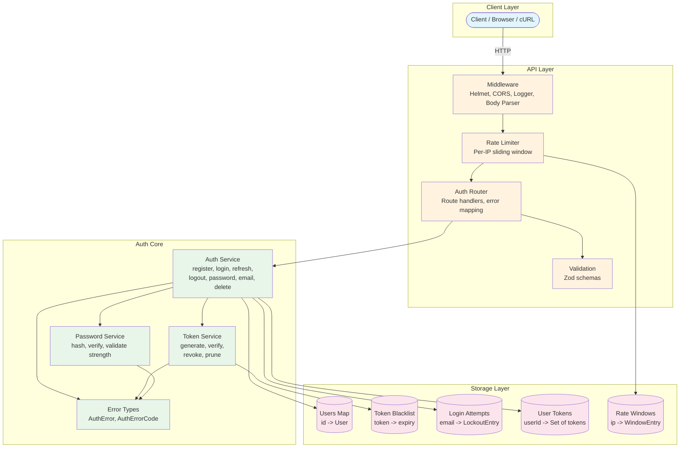
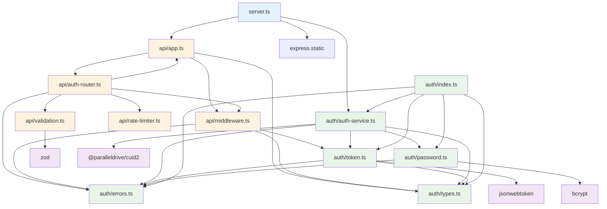
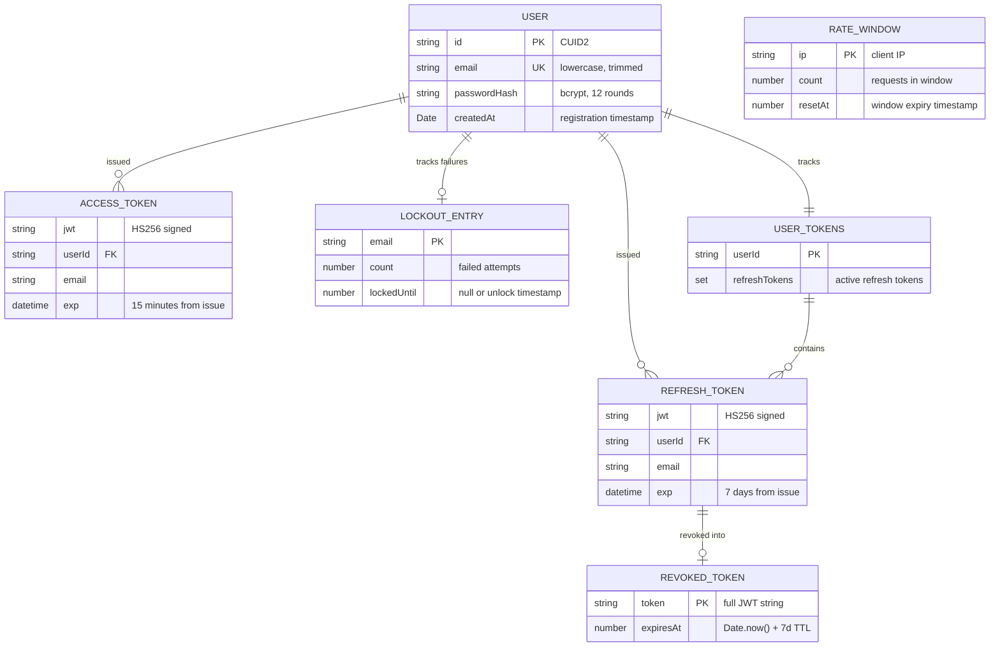
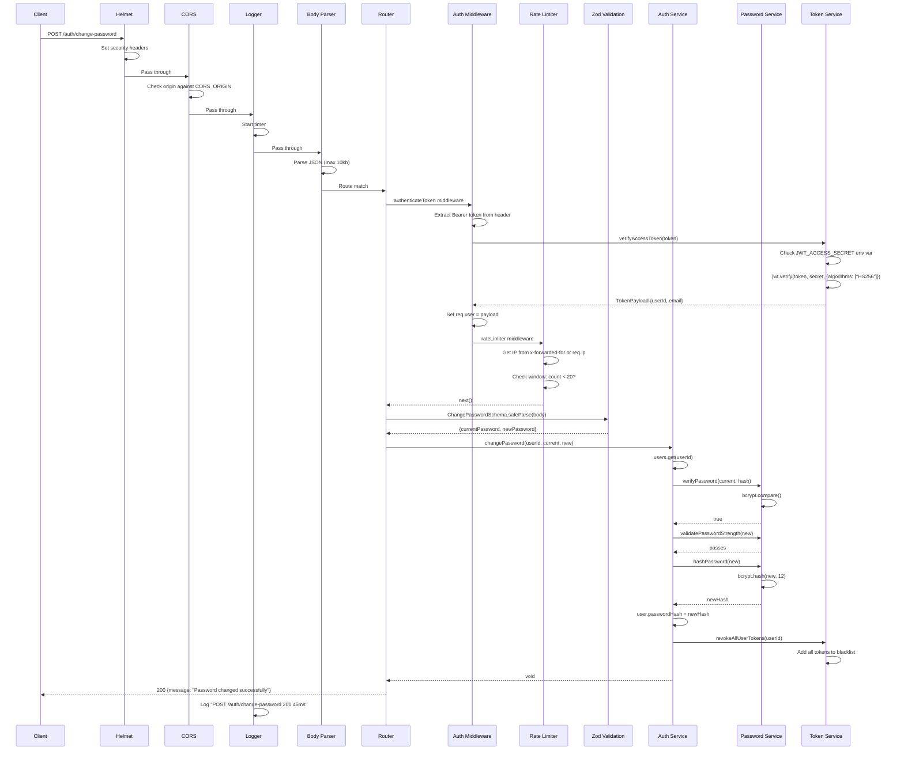
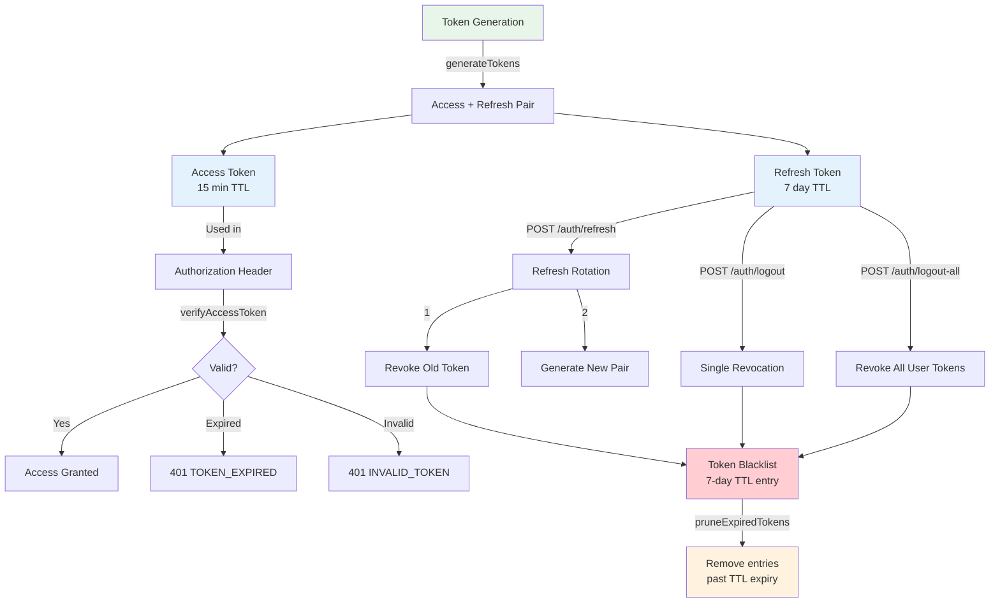
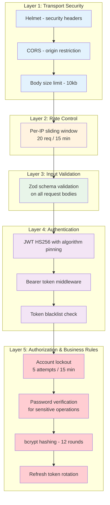
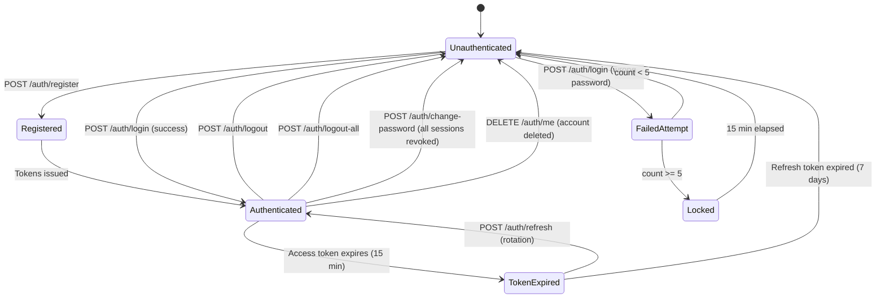
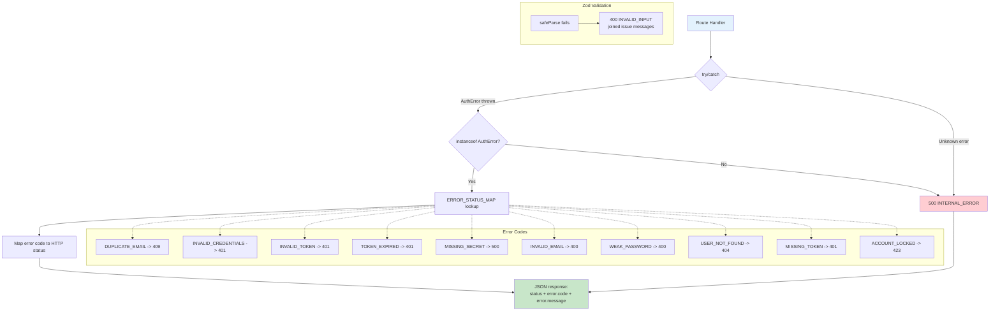

# Architecture

Detailed architecture documentation for jwt-module.

---

## Table of Contents

- [System Architecture](#system-architecture)
- [Module Dependency Graph](#module-dependency-graph)
- [Data Model](#data-model)
- [Request Lifecycle](#request-lifecycle)
- [Token Lifecycle](#token-lifecycle)
- [Security Architecture](#security-architecture)
- [Authentication State Machine](#authentication-state-machine)
- [Error Handling Architecture](#error-handling-architecture)
- [Configuration](#configuration)
- [File Structure](#file-structure)
- [Design Decisions](#design-decisions)
- [Known Limitations](#known-limitations)
- [Extension Points](#extension-points)

---

## System Architecture

The system follows a layered architecture with clear separation between the HTTP transport layer and the core authentication logic.



---

## Module Dependency Graph

Import relationships between all source modules:



---

## Data Model



---

## Request Lifecycle

Detailed sequence diagram for an authenticated request (e.g., `POST /auth/change-password`):



---

## Token Lifecycle



### Token Lifecycle Summary

1. **Generation** -- `generateTokens()` creates an access/refresh pair signed with HS256
2. **Registration** -- Refresh token is tracked per-user in the `userTokens` map
3. **Usage** -- Access token is sent as `Bearer` header, verified by middleware
4. **Rotation** -- On refresh, old token is revoked (blacklisted) and removed from user tracking; new pair is issued
5. **Revocation** -- Tokens are added to `revokedTokens` map with a 7-day TTL
6. **Expiry** -- JWT library rejects tokens past their `exp` claim
7. **Pruning** -- `pruneExpiredTokens()` removes blacklist entries past their TTL to prevent memory growth

---

## Security Architecture

Defense-in-depth with five security layers:



---

## Authentication State Machine



---

## Error Handling Architecture



**Error flow:**
1. Zod validation failures are caught before the auth service is invoked, returning `400 INVALID_INPUT`
2. Auth service functions throw `AuthError` with a typed `code` property
3. `handleAuthError()` in the router maps `AuthError.code` to an HTTP status via `ERROR_STATUS_MAP`
4. Unknown errors produce `500 INTERNAL_ERROR` with a generic message (no internal details leaked)

---

## Configuration

All configurable values in the system:

| Parameter | Location | Value | Configurable Via |
|---|---|---|---|
| Access token TTL | `token.ts` | 15 minutes | Code constant |
| Refresh token TTL | `token.ts` | 7 days | Code constant |
| Revocation blacklist TTL | `token.ts` | 7 days | Code constant |
| JWT algorithm | `token.ts` | HS256 | Code constant |
| bcrypt salt rounds | `password.ts` | 12 | Code constant |
| Password min length | `password.ts` | 8 | Code constant |
| Max login attempts | `auth-service.ts` | 5 | Code constant |
| Lockout duration | `auth-service.ts` | 15 minutes | Code constant |
| Rate limit window | `rate-limiter.ts` | 15 minutes | Code constant |
| Rate limit max requests | `rate-limiter.ts` | 20 | Code constant |
| Body size limit | `app.ts` | 10kb | Code constant |
| Server port | `server.ts` | 3000 | `PORT` env var |
| Access token secret | `token.ts` | -- | `JWT_ACCESS_SECRET` env var |
| Refresh token secret | `token.ts` | -- | `JWT_REFRESH_SECRET` env var |
| CORS origin | `app.ts` | `*` | `CORS_ORIGIN` env var |

---

## File Structure

```
jwt-module/
  src/
    auth/                          # Auth core -- framework-agnostic
      auth-service.ts              # Business logic: register, login, refresh, logout,
                                   #   changePassword, updateEmail, deleteAccount
                                   # In-memory stores: users, userTokens, loginAttempts
      errors.ts                    # AuthError class extending Error
                                   # AuthErrorCode union type (10 codes)
      password.ts                  # hashPassword (bcrypt 12 rounds)
                                   # verifyPassword, validatePasswordStrength
      token.ts                     # generateTokens, generateAccessToken, generateRefreshToken
                                   # verifyAccessToken, verifyRefreshToken
                                   # revokeRefreshToken, pruneExpiredTokens
                                   # In-memory store: revokedTokens
      types.ts                     # User, TokenPayload, AuthTokens,
                                   #   RegisterInput, LoginInput
      index.ts                     # Barrel exports for all auth module exports
    api/                           # HTTP transport layer
      app.ts                       # createApp factory, AuthService interface
                                   # Helmet, CORS, body parser, router wiring
      auth-router.ts               # createAuthRouter with all 10 route handlers
                                   # ERROR_STATUS_MAP, handleAuthError
      middleware.ts                # authenticateToken (Bearer verification)
                                   # requestLogger (method, path, status, duration)
      rate-limiter.ts              # rateLimiter middleware (per-IP sliding window)
                                   # In-memory store: windows
      validation.ts                # Zod schemas: Register, Login, Refresh, Logout,
                                   #   ChangePassword, UpdateEmail, DeleteAccount
                                   # zodError helper
    server.ts                      # Entry point: env defaults, createApp, static UI, listen
  public/                          # Interactive test UI (static HTML)
  dist/                            # Compiled JavaScript output
```

---

## Design Decisions

### Why in-memory storage?

The module is designed for development, prototyping, and education. In-memory `Map` objects provide zero-config operation with no external dependencies. The `AuthService` interface in `app.ts` makes it straightforward to swap in a persistent store.

### Why bcrypt with 12 rounds?

bcrypt is the industry standard for password hashing. 12 rounds provides a good balance between security and performance (~250ms per hash). The adaptive cost factor means it can be increased as hardware improves.

### Why HS256 for JWT?

HS256 (HMAC-SHA256) is the simplest JWT algorithm that provides sufficient security for a single-service module. RS256 would be appropriate for distributed systems where token verification needs to happen without sharing the signing secret, but adds key management complexity.

### Why Zod for validation?

Zod provides TypeScript-first schema validation with excellent type inference. It validates and narrows types in a single step, reducing boilerplate compared to manual validation. The schemas serve as both runtime validators and documentation.

### Why a custom rate limiter?

A simple per-IP sliding window rate limiter avoids adding a dependency like `express-rate-limit` for ~35 lines of code. The in-memory approach matches the overall storage strategy. For production, this should be replaced with a Redis-backed solution.

### Why refresh token rotation?

Refresh token rotation limits the damage of a stolen refresh token. Each use of a refresh token invalidates it and issues a new one. If an attacker uses a stolen token, the legitimate user's next refresh will fail (because the token was already rotated), signaling a compromise.

### Why algorithm pinning on verification?

Passing `{ algorithms: ["HS256"] }` to `jwt.verify()` prevents algorithm substitution attacks where an attacker could change the algorithm header to `none` or use the public key as an HMAC secret.

---

## Known Limitations

1. **No persistence** -- All data is lost on process restart. The `Map`-based stores do not survive across deployments.
2. **Single-process only** -- In-memory stores are not shared across worker processes or containers. Horizontal scaling requires a shared store (Redis, database).
3. **No token pruning scheduler** -- `pruneExpiredTokens()` exists but is never called automatically. Without periodic pruning, the revocation blacklist grows until restart.
4. **No email verification** -- Registration does not verify email ownership. Any syntactically valid email is accepted.
5. **No password reset** -- There is no forgot-password or reset-password flow.
6. **No 2FA/MFA** -- Single-factor authentication only.
7. **Rate limiter per-process** -- Rate limit windows are not shared across processes.
8. **No audit logging** -- Login attempts, password changes, and account deletions are not logged to a persistent audit trail.
9. **No HTTPS enforcement** -- The server does not redirect HTTP to HTTPS or set HSTS (handled by a reverse proxy in production).

---

## Extension Points

### Adding a Database

1. Create a `UserRepository` interface with methods: `findById`, `findByEmail`, `create`, `update`, `delete`
2. Implement it for your database (PostgreSQL, MongoDB, etc.)
3. Refactor `auth-service.ts` to accept the repository via dependency injection instead of using the in-memory `Map`
4. The `AuthService` interface in `app.ts` stays unchanged -- the API layer is unaffected

### Adding Redis for Token Storage

1. Create a `TokenStore` interface with methods: `revoke`, `isRevoked`, `prune`
2. Implement it using Redis with TTL-based expiry (replaces manual pruning)
3. Create a `RateLimitStore` interface for the rate limiter
4. This also enables multi-process and multi-container deployments

### Adding Email Verification

1. Create an `EmailService` interface with a `sendVerificationEmail` method
2. Add a `verified: boolean` field to the `User` type
3. Add `UNVERIFIED_EMAIL` to `AuthErrorCode` and `ERROR_STATUS_MAP`
4. Generate a verification token on registration, send via email, verify on callback endpoint
5. Gate login behind `verified === true`

### Adding Two-Factor Authentication (2FA)

1. Add `totpSecret: string | null` and `twoFactorEnabled: boolean` to the `User` type
2. Create endpoints: `POST /auth/2fa/setup` (returns QR code), `POST /auth/2fa/verify` (confirms setup), `POST /auth/2fa/validate` (validates TOTP on login)
3. Modify the login flow to return a partial token that requires 2FA validation before issuing full access
4. Use a TOTP library like `otpauth` or `speakeasy`
