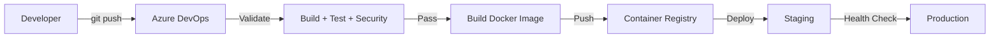
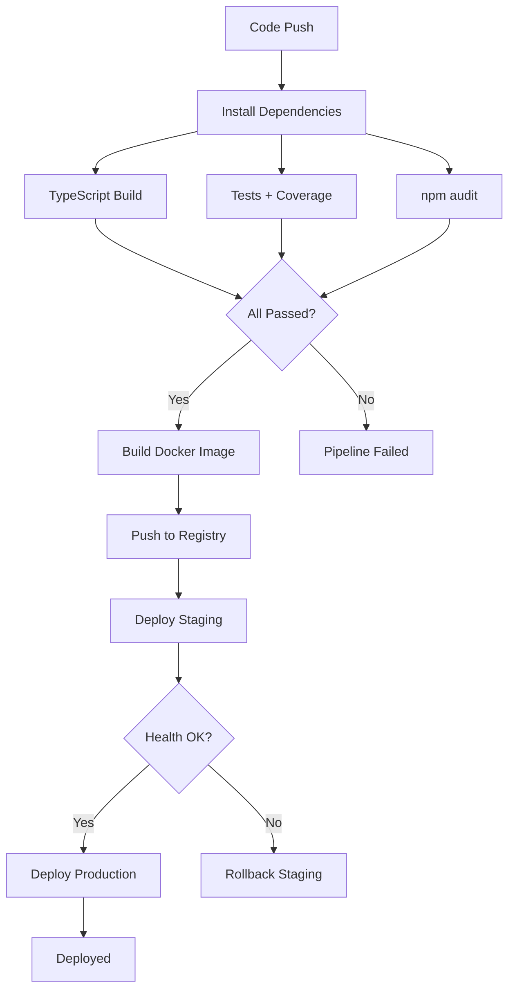

# Deployment Guide

## Deployment Architecture



## CI/CD Pipeline Stages



## Local Development

Start the development server:

```bash
make dev
# or
PORT=5001 npx ts-node src/server.ts
```

The server runs at `http://localhost:5001` with an interactive test UI.

## Docker Deployment

### Build the image

```bash
make docker-build
# or
docker build -t jwt-module .
```

### Run the container

```bash
export JWT_ACCESS_SECRET="your-strong-access-secret"
export JWT_REFRESH_SECRET="your-strong-refresh-secret"

make docker-run
# or
docker run -d --name jwt-module \
  -p 5001:5001 \
  -e PORT=5001 \
  -e JWT_ACCESS_SECRET="$JWT_ACCESS_SECRET" \
  -e JWT_REFRESH_SECRET="$JWT_REFRESH_SECRET" \
  jwt-module
```

### Using docker-compose

```bash
export JWT_ACCESS_SECRET="your-strong-access-secret"
export JWT_REFRESH_SECRET="your-strong-refresh-secret"

make docker-compose-up
# or
docker compose up -d
```

### Verify health

```bash
curl http://localhost:5001/health
```

### Environment Variables

| Variable | Required | Default | Production Recommendation |
|---|---|---|---|
| `PORT` | No | `5001` | Keep default or match your ingress config |
| `JWT_ACCESS_SECRET` | Yes | Dev fallback | Strong random string (64+ chars) |
| `JWT_REFRESH_SECRET` | Yes | Dev fallback | Strong random string (64+ chars), different from access secret |
| `CORS_ORIGIN` | No | `*` | Set to your frontend domain(s) |
| `NODE_ENV` | No | - | `production` |

### Resource Limits

docker-compose enforces:
- Memory: 256M
- CPU: 0.5 cores

Adjust in `docker-compose.yml` under `deploy.resources.limits` as needed.

## Security Checklist for Production

- [ ] Generate strong, unique JWT secrets (64+ characters)
- [ ] Set `CORS_ORIGIN` to specific allowed domains (never `*`)
- [ ] Place behind a reverse proxy (nginx, Traefik, etc.)
- [ ] Enable TLS termination at the proxy
- [ ] Set `NODE_ENV=production`
- [ ] Verify rate limiter is active
- [ ] Configure centralized logging
- [ ] Container runs as non-root user (`appuser`)
- [ ] Resource limits are set appropriately

## Health Monitoring

The `/health` endpoint returns `200 OK` when the service is running.

Docker HEALTHCHECK is configured:
- Interval: 30 seconds
- Timeout: 5 seconds
- Start period: 10 seconds
- Retries: 3

For production, integrate with your monitoring stack (Prometheus, Datadog, etc.) by scraping the health endpoint.

## Scaling Considerations

This module uses in-memory storage. For production at scale:

| Component | Current | Production Alternative |
|---|---|---|
| User store | In-memory Map | PostgreSQL / MongoDB |
| Rate limiter | In-memory Map | Redis |
| Token blacklist | In-memory Set | Redis with TTL |
| Session state | In-memory | Redis |

When scaling horizontally behind a load balancer, all stateful components must move to shared stores. Without this, each instance has isolated state and users may get inconsistent behavior.

## Rollback Procedure

Each build produces a Docker image tagged with the Azure DevOps build ID.

To roll back:

```bash
# List available tags
docker images jwt-module --format "{{.Tag}}"

# Roll back to a previous version
docker stop jwt-module && docker rm jwt-module
docker run -d --name jwt-module \
  -p 5001:5001 \
  -e PORT=5001 \
  -e JWT_ACCESS_SECRET="$JWT_ACCESS_SECRET" \
  -e JWT_REFRESH_SECRET="$JWT_REFRESH_SECRET" \
  jwt-module:<previous-build-id>
```

For orchestrated environments (Kubernetes, etc.), update the image tag in your deployment manifest and apply.
