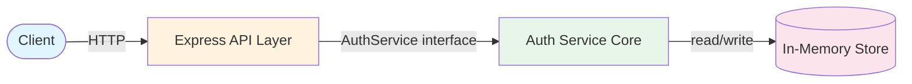
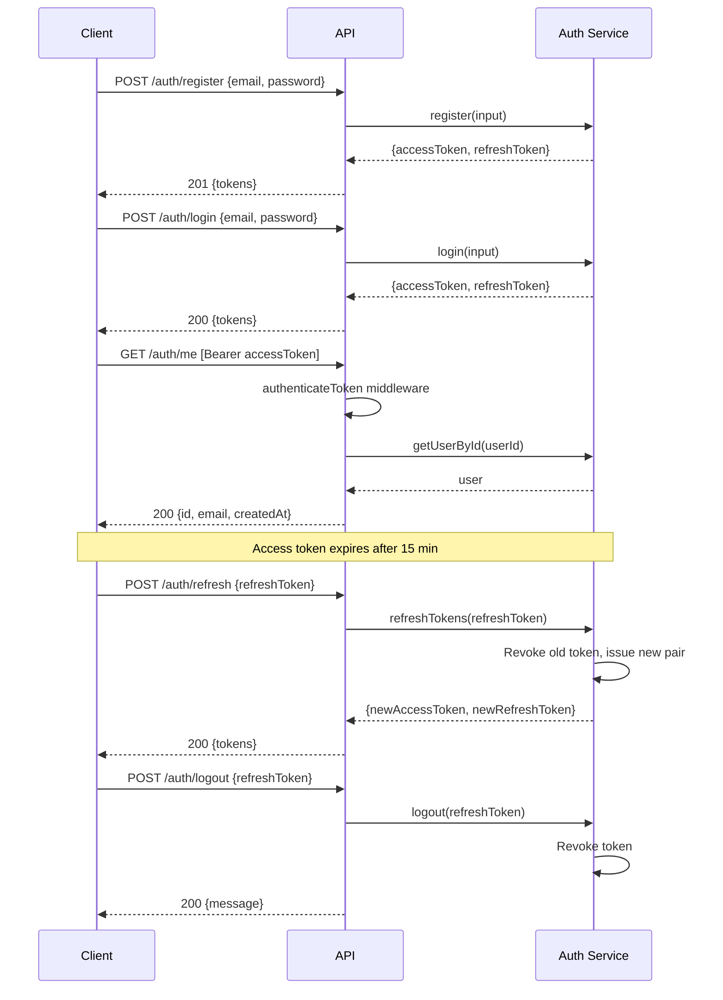
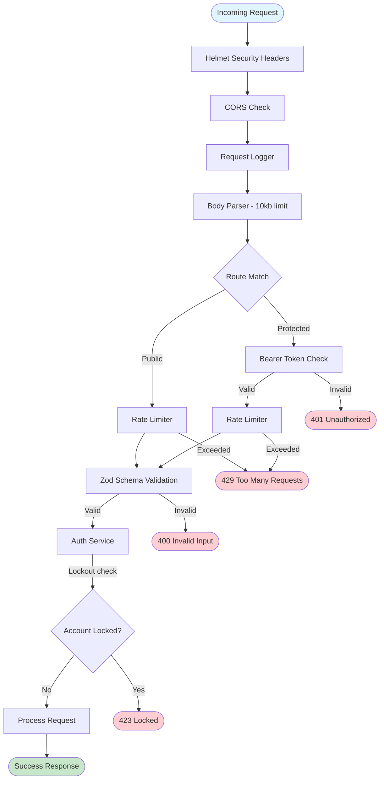
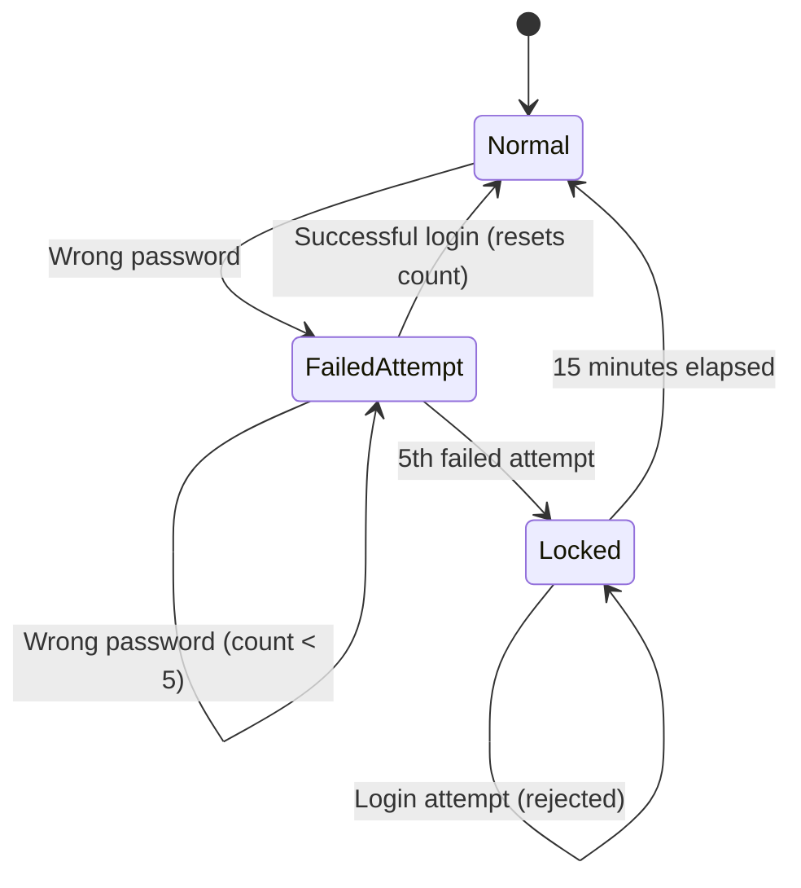

# :lock: jwt-module

**A standalone JWT authentication module built with Express and TypeScript.**


---

## Overview

jwt-module is a self-contained authentication service providing user registration, login, JWT-based access/refresh tokens with rotation, and full account management through a REST API. It uses in-memory storage, making it ideal for development, prototyping, and learning.



> **Note:** All data is lost on restart. For production use, implement a persistent backing store behind the existing interfaces.

---

## Features

- :bust_in_silhouette: **User Registration** -- email/password signup with duplicate detection
- :key: **Login** -- credential verification with JWT token pair issuance
- :arrows_counterclockwise: **Refresh Token Rotation** -- old tokens revoked on every refresh, new pair issued
- :shield: **Account Lockout** -- automatic lock after 5 failed login attempts (15 min cooldown)
- :traffic_light: **Rate Limiting** -- per-IP sliding window (20 requests / 15 min) on sensitive endpoints
- :outbox_tray: **Logout / Logout All** -- single-session and all-session token revocation
- :lock: **Change Password** -- requires current password, revokes all sessions
- :envelope: **Update Email** -- requires password confirmation, duplicate check
- :wastebasket: **Delete Account** -- requires password confirmation, full cleanup
- :mag: **Get Profile** -- returns user ID, email, and creation date
- :white_check_mark: **Health Check** -- `GET /health` for uptime monitoring
- :helmet_with_white_cross: **Helmet** -- security headers on all responses
- :globe_with_meridians: **CORS** -- configurable allowed origins
- :pencil: **Zod Validation** -- schema validation on all request bodies

---

## Quick Start

```bash
# Clone the repository
git clone <repo-url> jwt-module
cd jwt-module

# Install dependencies
npm install

# Set environment variables (or use dev defaults)
cp .env.example .env

# Build
npm run build

# Start development server
npx ts-node src/server.ts
```

The server starts on `http://localhost:3000` by default. A test UI is served at the root URL.

---

## Environment Variables

| Variable | Description | Default | Required |
|---|---|---|---|
| `JWT_ACCESS_SECRET` | Secret for signing access tokens | Dev fallback | Yes (in production) |
| `JWT_REFRESH_SECRET` | Secret for signing refresh tokens | Dev fallback | Yes (in production) |
| `PORT` | Server listen port | `3000` | No |
| `NODE_ENV` | Runtime environment | -- | No |
| `CORS_ORIGIN` | Allowed origins (comma-separated or `*`) | `*` | No |

In development, fallback secrets are applied automatically. **Always set real secrets in production.**

---

## API Reference

All endpoints return JSON. Error responses use the shape:

```json
{ "error": { "code": "ERROR_CODE", "message": "Human-readable message" } }
```

### POST /auth/register

Create a new account.

- **Auth:** None
- **Body:** `{ "email": "user@example.com", "password": "securePass1" }`
- **Success:** `201`
  ```json
  { "tokens": { "accessToken": "...", "refreshToken": "..." } }
  ```
- **Errors:** `400 INVALID_EMAIL` | `400 WEAK_PASSWORD` | `400 INVALID_INPUT` | `409 DUPLICATE_EMAIL`

### POST /auth/login

Authenticate and receive tokens.

- **Auth:** None
- **Body:** `{ "email": "user@example.com", "password": "securePass1" }`
- **Success:** `200`
  ```json
  { "tokens": { "accessToken": "...", "refreshToken": "..." } }
  ```
- **Errors:** `401 INVALID_CREDENTIALS` | `423 ACCOUNT_LOCKED` | `400 INVALID_INPUT`

### POST /auth/refresh

Exchange a refresh token for a new token pair. The old refresh token is revoked (rotation).

- **Auth:** None
- **Body:** `{ "refreshToken": "..." }`
- **Success:** `200`
  ```json
  { "tokens": { "accessToken": "...", "refreshToken": "..." } }
  ```
- **Errors:** `401 INVALID_TOKEN` | `401 TOKEN_EXPIRED` | `404 USER_NOT_FOUND` | `400 INVALID_INPUT`

### POST /auth/logout

Revoke a single refresh token.

- **Auth:** None
- **Body:** `{ "refreshToken": "..." }`
- **Success:** `200`
  ```json
  { "message": "Logged out successfully" }
  ```

### POST /auth/logout-all

Revoke all refresh tokens for the authenticated user.

- **Auth:** Bearer token
- **Body:** None
- **Success:** `200`
  ```json
  { "message": "All sessions revoked successfully" }
  ```
- **Errors:** `401 MISSING_TOKEN` | `401 INVALID_TOKEN` | `401 TOKEN_EXPIRED`

### POST /auth/change-password

Change password for the authenticated user. Revokes all sessions.

- **Auth:** Bearer token
- **Body:** `{ "currentPassword": "oldPass1", "newPassword": "newPass1" }`
- **Success:** `200`
  ```json
  { "message": "Password changed successfully" }
  ```
- **Errors:** `401 MISSING_TOKEN` | `401 INVALID_CREDENTIALS` | `400 WEAK_PASSWORD` | `400 INVALID_INPUT`

### GET /auth/me

Get the authenticated user's profile.

- **Auth:** Bearer token
- **Success:** `200`
  ```json
  { "id": "...", "email": "user@example.com", "createdAt": "2026-01-01T00:00:00.000Z" }
  ```
- **Errors:** `401 MISSING_TOKEN` | `401 INVALID_TOKEN` | `404 USER_NOT_FOUND`

### PATCH /auth/me

Update the authenticated user's email.

- **Auth:** Bearer token
- **Body:** `{ "newEmail": "new@example.com", "password": "currentPass1" }`
- **Success:** `200`
  ```json
  { "message": "Email updated successfully" }
  ```
- **Errors:** `401 MISSING_TOKEN` | `401 INVALID_CREDENTIALS` | `400 INVALID_EMAIL` | `409 DUPLICATE_EMAIL` | `400 INVALID_INPUT`

### DELETE /auth/me

Delete the authenticated user's account.

- **Auth:** Bearer token
- **Body:** `{ "password": "currentPass1" }`
- **Success:** `200`
  ```json
  { "message": "Account deleted successfully" }
  ```
- **Errors:** `401 MISSING_TOKEN` | `401 INVALID_CREDENTIALS` | `400 INVALID_INPUT`

### GET /health

Health check endpoint.

- **Auth:** None
- **Success:** `200`
  ```json
  { "status": "ok" }
  ```

---

## Authentication Flow



---

## Security Features

### Request Lifecycle

Every incoming request passes through multiple security layers before reaching the auth service:



### Security Summary

| Layer | Mechanism | Details |
|---|---|---|
| Transport | Helmet | Security headers (X-Content-Type-Options, X-Frame-Options, etc.) |
| Transport | CORS | Configurable allowed origins |
| Transport | Body size limit | 10kb max JSON payload |
| Rate control | Per-IP rate limiter | 20 requests per 15-minute sliding window |
| Input validation | Zod schemas | Type-safe validation on all request bodies |
| Authentication | JWT HS256 | Algorithm pinning prevents substitution attacks |
| Authorization | Bearer middleware | Access token verification on protected routes |
| Brute force | Account lockout | 5 failed attempts triggers 15-minute lock |
| Token security | Refresh rotation | Old tokens revoked on each refresh |
| Password | bcrypt (12 rounds) | Adaptive hashing with salt |

---

## Account Lockout Flow



- **Threshold:** 5 consecutive failed attempts per email
- **Lockout duration:** 15 minutes
- **Reset:** Successful login clears the failure counter

---

## Error Codes

| Error Code | HTTP Status | Description |
|---|---|---|
| `INVALID_INPUT` | 400 | Request body failed Zod validation |
| `INVALID_EMAIL` | 400 | Email format is invalid |
| `WEAK_PASSWORD` | 400 | Password does not meet strength requirements |
| `INVALID_CREDENTIALS` | 401 | Wrong email or password |
| `MISSING_TOKEN` | 401 | Authorization header missing or malformed |
| `INVALID_TOKEN` | 401 | Token is invalid or revoked |
| `TOKEN_EXPIRED` | 401 | Token has expired |
| `USER_NOT_FOUND` | 404 | User does not exist |
| `DUPLICATE_EMAIL` | 409 | Email already registered |
| `ACCOUNT_LOCKED` | 423 | Too many failed login attempts |
| `RATE_LIMITED` | 429 | IP exceeded request limit |
| `MISSING_SECRET` | 500 | JWT secret environment variable not set |
| `INTERNAL_ERROR` | 500 | Unexpected server error |

---

## Password Requirements

- Minimum **8 characters**
- At least **one letter** (a-z or A-Z)
- At least **one digit** (0-9)
- Hashed with **bcrypt** using **12 salt rounds**

---

## Development

### Commands

```bash
# Run tests
npm test

# Run tests with coverage
npm run test:coverage

# Build TypeScript
npm run build

# Start dev server (with default secrets)
npx ts-node src/server.ts

# Start on custom port
PORT=5001 npx ts-node src/server.ts
```

### Project Structure

```
src/
  auth/                  # Core auth logic (no HTTP dependency)
    auth-service.ts      # Registration, login, refresh, account management
    errors.ts            # AuthError class and AuthErrorCode union type
    password.ts          # bcrypt hashing and password strength validation
    token.ts             # JWT generation, verification, revocation blacklist
    types.ts             # Shared interfaces (User, AuthTokens, TokenPayload, etc.)
    index.ts             # Barrel export for auth module
  api/                   # HTTP layer
    app.ts               # Express app factory, AuthService interface
    auth-router.ts       # Route handlers, error-to-HTTP-status mapping
    middleware.ts         # authenticateToken, requestLogger
    rate-limiter.ts      # Per-IP sliding window rate limiter
    validation.ts        # Zod schemas for all request bodies
  server.ts              # Entry point -- wires auth-service into Express app
public/                  # Static test UI
```

### Adding a New Endpoint

1. Add the method to the `AuthService` interface in `src/api/app.ts`
2. Implement the logic in `src/auth/auth-service.ts`
3. Add a Zod schema in `src/api/validation.ts`
4. Add the route handler in `src/api/auth-router.ts`
5. If a new error code is needed, add it to `AuthErrorCode` in `src/auth/errors.ts` and to `ERROR_STATUS_MAP` in `src/api/auth-router.ts`

---

## Architecture

See [ARCHITECTURE.md](./ARCHITECTURE.md) for detailed architecture documentation with diagrams.

---

## License

MIT
